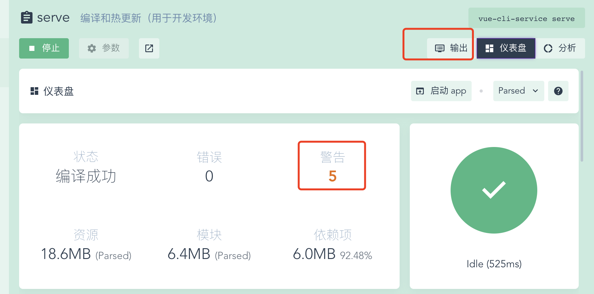

# 使用vue实现的电商管理系统
## 一、目标:
- 能够基于Vue初始化项目;
- 能够基于Vue技术进行项目开发;
- 能够使用Vue的第三方组件进行项目开发;
- 能够说出前后端分离的开发模式;

## 二、项目概述:
- 客户使用的业务服务：PC端，小程序，移动web，移动app
- 管理员使用的业务服务：PC后台管理端。
- PC后台管理端的功能：管理用户账号（登录，退出，用户管理，权限管理），商品管理（商品分类，分类参数，商品信息，订单），数据统计


- 电商后台管理系统采用前后端分离的开发模式
- 前端项目是基于Vue的SPA（单页应用程序）项目

- 前端技术栈:Vue,Vue-Router,Element-UI,Axios,Echarts
- 后端技术栈：Node.js,Express,Jwt(模拟session),Mysql,Sequelize(操作数据库的框架)


## 三、项目初始化:

### 1. 初始化前端项目:
- 安装Vue脚手架
- 通过脚手架创建项目
- 配置路由
- 配置Element-UI:在插件中安装，搜索```vue-cli-plugin-element```
- 配置Axios：在依赖中安装,搜索axios(运行依赖)
- 初始化git仓库
- 将本地项目托管到github或者码云中

### 2. 配置后台项目:

```
参考 "电商管理后台API接口文档.md"
```

## 四、登录/退出功能:
### 1. 登录业务流程:
- 在登陆页面输入用户名和密码;
- 调用后台接口进行验证;
- 通过验证之后, 根据后台的响应状态跳转到项目页面;

### 2. 相关技术点:
- http无状态:
- 通过cookie/session记录状态;
- 通过token方式维持状态保持;

**注意:**
- 前后端不存在跨域, 使用cookie/session;
- 前后端存在跨域, 使用token;

## 五、主页布局：


## 六、用户管理模块：
### 1. 权限管理业务分析:
通过权限管理模块控制不同的用户可以进行哪些操作, 具体可以通过角色的方式进行控制, 即每个用户分配一个特定的角色,角色包括不同的权限


## 七、权限管理模块：


## 八、分类管理模块：
商品管理的树形表格是element-ui没有的,所以需要使用```vue-table-with-tree-grid```
在vue-cli的```依赖```中进行安装


## 九、参数管理模块：
商品参数用于**显示商品固定的特征信息**, 可以通过电商平台详情页直观的看到;
- 动态参数:
- 静态属性:


## 十、商品管理模块：
```
npm install v-viewer
```
vue的图片浏览插件

富文本编辑器:
安装依赖(运行依赖) => vue-quill-editor

## 十一、订单管理模块：


## 十二、数据统计模块：
使用```echarts```实现数据报表功能

# 十三、项目优化上线：
## 1. 能够优化Vue项目：
### 1.1 项目优化策略:
- 生成打包报告;
- 第三方库的CDN加载;
- Element-UI组件按序加载;
- 路由懒加载;
- 首页内容定制;

### 1.2 添加页面进度条:
使用第三方插件```nprogress```
github: [https://github.com/rstacruz/nprogress](https://github.com/rstacruz/nprogress)

#### a. 安装:
vue-cli中```依赖 -> 运行依赖```搜索```nprogress```安装即可;
#### b. 使用:

简单的调用```start```和```done()```来控制进度条
```js
import NProgress from 'nprogress'

NProgress.start();
NProgress.done();
```
在本项目中, 用过在ajax拦截器中使用调用```start```和```done()```:
```js
./main.js

...
// 导入nprogress
import NPrpgress from 'nprogress'
import 'nprogress/nprogress.css'

axios.defaults.base = 'http://127.0.0.1:8888/api'
// 在request拦截器中展示进度条
axios.interceptors.request.use(config => {
  ...
  NPrpgress.start()
  return config
})
// 在response中隐藏进度条
axios.interceptors.response.use(config => {
  NPrpgress.done()
  return config
})
Vue.prototype.$http = axios
Vue.config.productionTip = false

...
```
### 1.3 解决开发打包运行中的```警告```:


### 1.4 解决生产打包过程中的```警告```:

#### a.使用```babel-plugin-transform-remove-console```解决生产打包不允许代码出现console.log:
- 使用```babel-plugin-transform-remove-console```
[https://www.npmjs.com/package/babel-plugin-transform-remove-console](https://www.npmjs.com/package/babel-plugin-transform-remove-console)
- 安装:
在```vue-cli```中, ```依赖 -> 开发依赖```, 搜索```babel-plugin-transform-remove-console```并安装;
- 使用:

```js
./babel.config.js
module.exports = {
  presets: [
    '@vue/cli-plugin-babel/preset'
  ],
  plugins: [
    [
      'component',
      {
        libraryName: 'element-ui',
        styleLibraryName: 'theme-chalk'
      }
    ],
    // 增加节点
    'transform-remove-console'
  ]
}
```


## 2. 能够部署Vue项目: